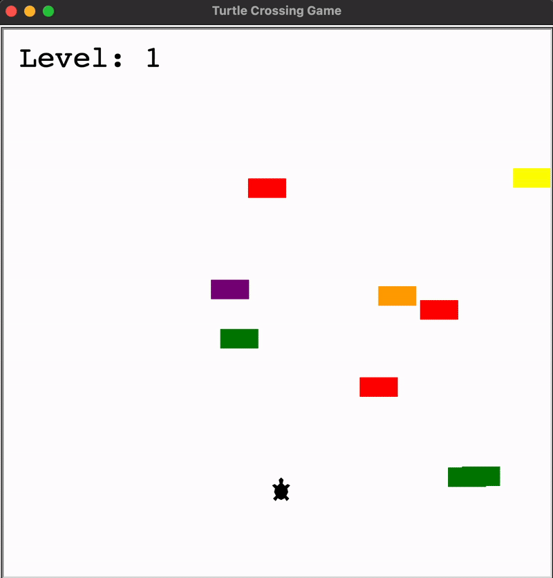

# 🐢 Turtle Crossing Game

A classic arcade-style crossing game built entirely using Python's built-in **Turtle Graphics** library. Guide your little turtle across a busy highway, avoid the randomly generated cars 🚗, and reach the finish line to advance to the next, faster level! 🚀

---

## 🚦 Game Overview

This project is a simple implementation of a "Frogger" or "Crossy Road" style game where the objective is survival and progress. The player (a turtle) starts at the bottom and must navigate to the top of the screen without colliding with the endless, horizontally moving traffic.

### 🕹️ How to Play

1.  **Move:** Use the **Up arrow key** ⬆️ to move the turtle forward.
2.  **Objective:** Reach the **finish line** to successfully complete the level.
3.  **Level Up:** Upon crossing, the car speed increases 💨, and the **Level** on the scoreboard increments.
4.  **Collision:** If the turtle touches any car 💥, the game ends immediately.

---

## ⚙️ Setup and Installation

### Prerequisites

You only need **Python** installed on your machine. The game uses only standard, built-in libraries (`turtle`, `time`, `random`).

### 🚀 Running the Game

1.  **Clone the repository:**
    ```bash
    git clone https://github.com/dharsan19/turtle-crossing-game.git
    cd turtle-crossing-game
    ```
2.  **Run the main script:**
    ```bash
    python main.py
    ```
    A new graphics window will pop up, ready for you to start playing! 🎉

---

## 📂 Project Structure

The game logic is modularized into several Python classes for clarity and maintainability:

| File | Class | Responsibility |
| :--- | :--- | :--- |
| `main.py` | *(n/a)* | The game loop, screen setup, collision checks, and level progression. |
| `player.py` | `Player` | Handles the turtle's creation, movement, and finish-line checking. |
| `car_manager.py` | `CarManager` | Creates new cars, moves all existing cars, and increases car speed (`level_up`). |
| `scoreboard.py` | `Scoreboard` | Manages and displays the current level and the "GAME OVER" message. |

---
## 🎥 Demo

<p align="center">
  
</p>